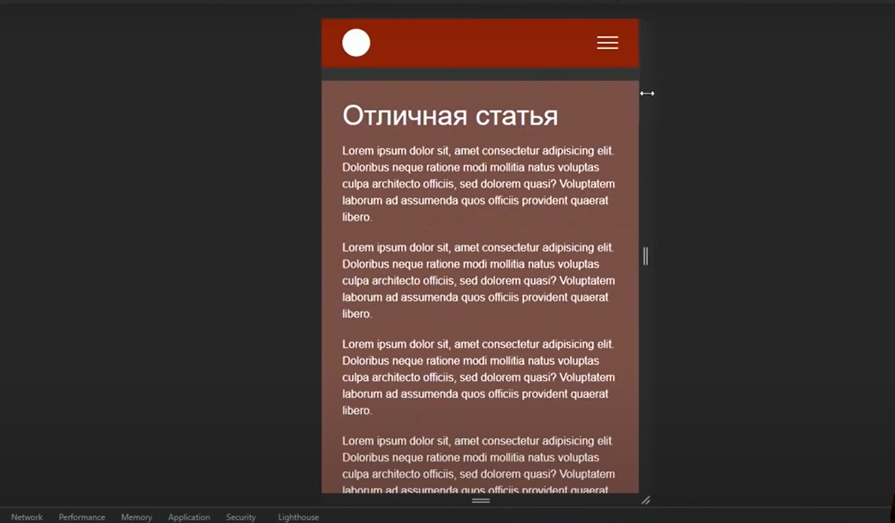
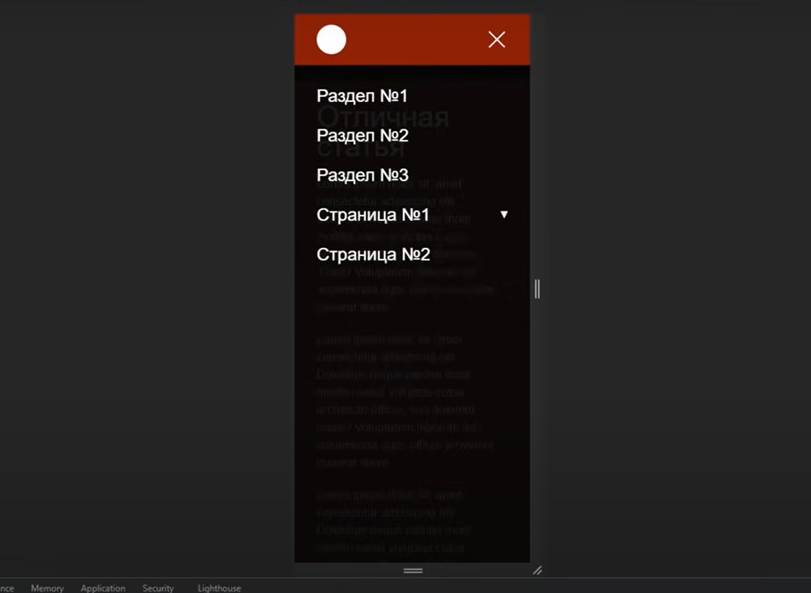

# burger-menu

### Example burger menu with smooth scrolling to content

[original source:'freelance by life'](https://www.youtube.com/watch?v=zs1r8yafTE8)

Use:
* Sass and BEM
* JS

================================================================

Если вы используете Node.js, то вы можете установить Sass c помощью npm:

npm install -g sass

Когда вы используете Sass через командную строку, то для того, чтобы запустить компиляцию .sass и .scss в .css файлы введите команду sass. Например:

sass source/stylesheets/index.scss build/stylesheets/index.css

Также, вы можете следить за изменениями только определенных файлов или папок, используя флаг --watch. Данный флаг сообщает Sass, что необходимо следить за изменениями указанных файлов и при наличии таковых производить перекомпиляцию CSS после сохранения файлов. Если вы хотите отслеживать изменения (вместо ручной перекомпиляции) вашего файла, например, input.scss, то вам необходимо просто добавить флаг в команду:

sass –watch input.scss output.css